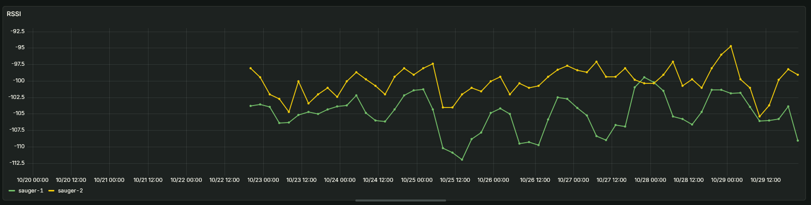
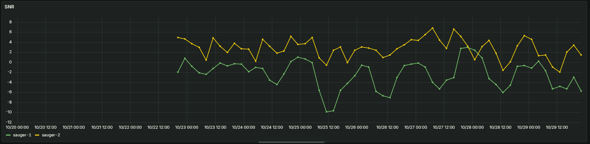
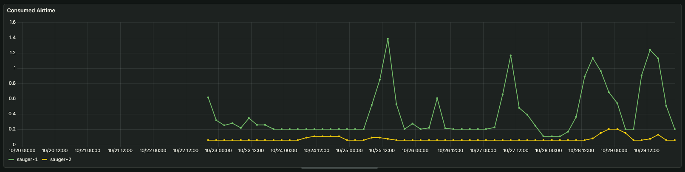
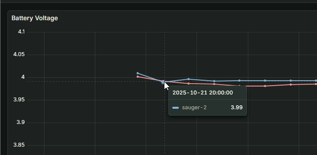
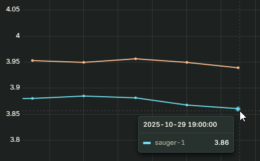
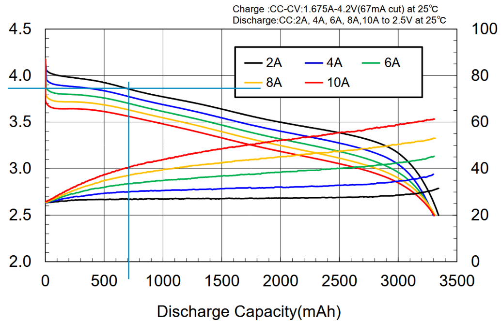
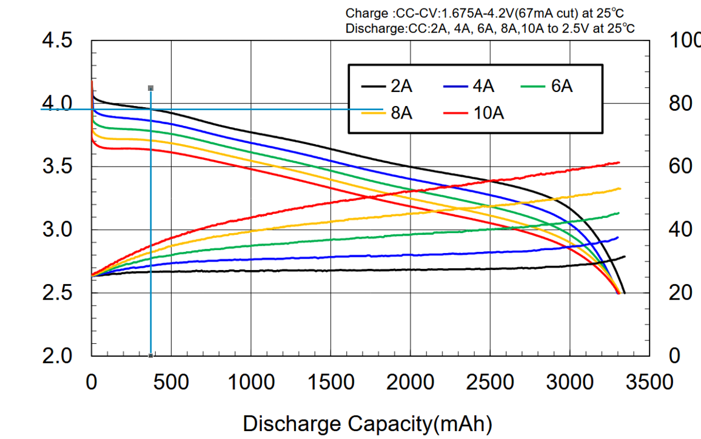

# Experiment - battery drainage by source

## 1. Goal and Scope

- Find out how much the sensor power is drained by deep sleep vs signal transfer

## 2. Setup and Method

- 2 sensors, sauger-1 and sauger-2, aro both deployed at the same spot
- both have the same hardware revision and are both fully charged
- sauger-1 has a 5-min interval of sensor upload
- sauger-2 has a 60-min interval of sensor upload
- the voltage is measured regularly and reported back via LoRaWAN
- based on the charging curve and the rest voltage, power consumption can be deducted

## 3. Data Analysis

### Sensor Comparability

- For the more frequent sending sensor, a lower RSSI and SNR can be observed
  
  
  This might be due to Adaptive Data Rate settings from LoRaWAN gateways. Physical differences in the sensors seem unlikely.

  

Interestingly, spikes in airtime coincide with worse RSSI.

### Raw measurements

- Both sensor have very similar starting chage, the delta is likely below the measurement threshold, as can be seen in the graphic
- datapoints are aggregated acroos 3 hours to mitigate measurement errors
- Start date of the used measurements: 21.10.2025 20:00

  

- End date of measurements: 29.10.2025 19:00

  

- Time Delta: 191h
- Initial Voltage sauger-1: 3,99V
- Initial Voltage sauger-2: 3,99V
- Final Voltage sauger-1: 3,86V
- Final Voltage sauger-2: 3,94V

Based on the charging curves of the used battery type, this results in the following charges:

- Final discharge capacity sauger-1: 700mAh
- Final discharge capacity sauger-2: 370mAh

Power Consumption sauger-1

Power Consumption sauger-2

Discharge capacities have been estimated based on the 2A discharge. While this is far higher than the currently used discharge, the qualitative decline of the curves look quite similar.

### Data Quality Conclusions

- In Scope: 2 energy consumption modes, transfer and deep sleep

- The calculations should be quite precise in regards to the relative consumptions

- The calculations skew towards a lower absolute energy consumption for both modes due to the lower discharge rate than the curve

- Although both sensors have the same physical location, differences in network quality can be observed. This is possibly due network site adjustments to reduce the airtime

## 4. Calculation and Conclusions

Power Calculation:

Legend:

- P[s]: Power Usage in 1h of deep sleep
- P[t]: power Usage during 1 message transfer

Assumptions:

- it is assumed data a data transfer takes 1,5 seconds
  - assuming realistic times (1-3s) will only negligably change the results
- It is assumed that sauger 1 and 2 both consume the same power during transfer and deep sleep

sauger-1 equation:

- 700mAh = 191h \* 12 P[t]/h + 191\*P[s]
- 700mAh = 2292 \* P[t] + 191 P[2]

sauger-2 equation:

- 360mAh = 191h \* 1 P[t]/h + 191 \* P[s]
- 360mAh = 191 \* P[t] + 191 \* P[s]

joint equation:

- 340mAh = 2101 \* P[t]
- P[t] ~= 0,1618mAh

calculating P[s]:

- 360mAh = 191 \* P[t] + 191 \* P[s]
- 360mAh = 191 \* 0,16mAh + 191 \* P[s]
- 360mAh = 30,9mAh + 191 \* P[s]
- 329,1mAh = 191 \* P[s]
- P[s] = 1,72mAh

### Final Result

- P[s] = 1,72mAh
- P[t] ~= 0,1618mAh

given a 10 min transfer interval, this results in

- 1,72mAh / 64% power consumption for deep sleep
- 0,971mAh / 36% power consumption for signal transfer

### Conclusion

- quite a lot of energy is consumed during deep sleep
- a ~20% deployment lifetime improvement can be achieved by halving the transfer rate
