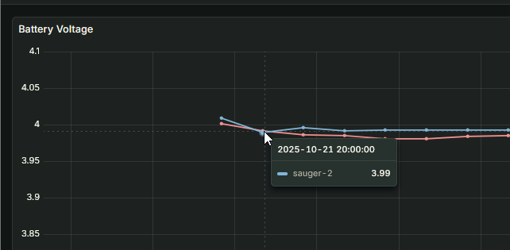
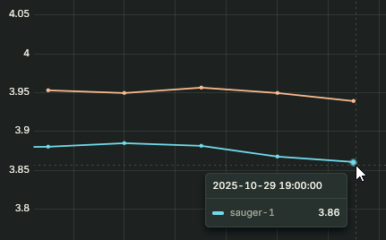
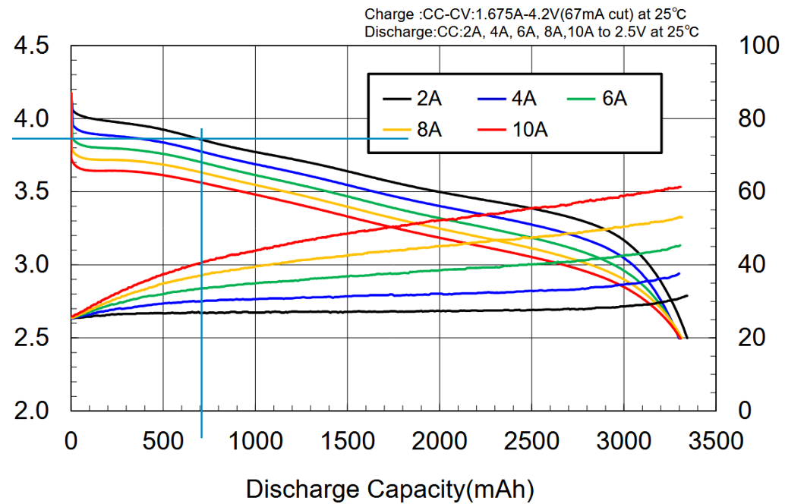
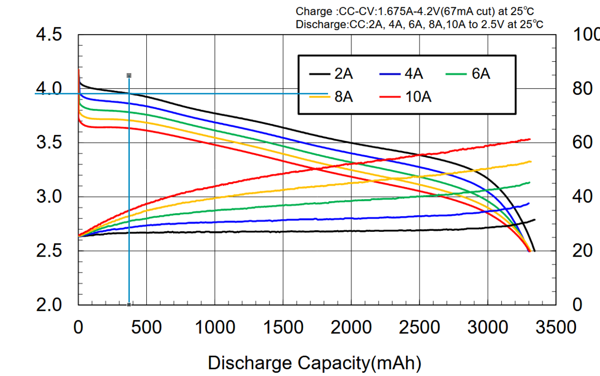

# Experiment - battery drainage by source

## 1. Goal and Scope

- Find out how much the sensor power is drained by deep sleep vs signal transfer

## 2. Setup and Method

- 2 sensors, sauger-1 and sauger-2, aro both deployed at the same spot
- both have the same hardware revision and are both fully charged
- sauger-1 has a 5-min interval of sensor upload
- sauger-2 has a 60-min interval of sensor upload
- the voltage is measured regularly and reported back via LoRaWAN
- based on the charging curve and the rest voltage, power consumption can be deducted

## 3. Data Analysis

### Sensor Comparability

tbd

### Raw measurements

- Both sensor have very similar starting chage, the delta is likely below the measurement threshold, as can be seen in the graphic
- datapoints are aggregated acroos 3 hours to mitigate measurement errors
- Start date of the used measurements: 21.10.2025 20:00
  

- End date of measurements: 29.10.2025 19:00
  

- Time Delta: 191h
- Initial Voltage sauger-1: 3,99V
- Initial Voltage sauger-2: 3,99V
- Final Voltage sauger-1: 3,86V
- Final Voltage sauger-2: 3,94V

Based on the charging curves of the used battery type, this results in the following charges:

- Final discharge capacity sauger-1: 700mAh
- Final discharge capacity sauger-2: 370mAh

Power Consumption sauger-1

Power Consumption sauger-2

Discharge capacities have been estimated based on the 2A discharge. While this is far higher than the currently used discharge, the qualitative decline of the curves look quite similar.

### Data Quality Conclusions

- The calculations should be quite precise in regards to the relative consumptions
- The calculations skew towards a lower absolute energy consumption due to the lower discharge rate than the curve

## 4. Calculation and Conclusions

tbd
