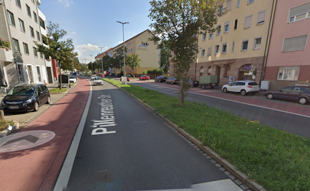
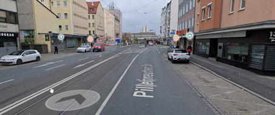

# High Level Strategie

## Problem

1. Leute sind desinteressiert an Klimawandel
1. Leute wollen keine lebenswerte Stadt
1. Niemand sieht die Vorteile einer grünen Stadt

## Vision

1. Leute wollen in einer lebenswerten Stadt leben
1. Die Vorteile einer grünen, autofreien Stadt werden erkannt

## Mission

1. Bewusstmachen von Mikroklimata in der Stadt
1. Quantifizieren von Hitzeinseln um Handlungsbedarf aufzuzeigen

# Konkrete Marketing Massnahmen

## Live Präsentation des Projekts

### Live Beispiele
- Bilderstrecke, Vergleich 2er ähnlicher Orte, einer grün, einer nicht
- Ortsteil sollte klar erkennbar sein
- Mit konkreten Vergleichstemperaturen zur gleichen Zeit
- Beispiel:
  - Pillenreuther 15 vs. Pillenreuther 93?
  - Aufseßplatz vs. Annapark
- vielleicht auch Vergleich mit Pegnitz? 1-3 Sensoren woanders aufhängen?

### Großer Plakataufsteller

- Screenshot von Karte
- Bilder von Sensoren
- Beispiele zu Messreihen

## Social Marketing

### 📈 Micro-Targeting auf Instagram: Öffentlicher Dienst Nürnberg mit 100 € Budget

 Ziel
- Aufmerksamkeit / Sichtbarkeit (Brand Awareness)
- Erkenntnisse sammeln, welche Botschaften & Motive wirken

 Vorgehen

 Kampagnenziel
- Traffic (wenn auf Landingpage leiten)

 Zielgruppe
- Standort: Nürnberg (+10 km)
- Alter: 25–60
- Interessen: „öffentlicher Dienst“, „Beamter“, „Verwaltung“, „Tarifvertrag“, „Gewerkschaft“
- Sprache: Deutsch

Laufzeit & Budget
- 5–7 Tage Laufzeit
- ca. 15–20 €/Tag
- nicht alles auf einen Tag verbrennen → Algorithmus lernen lassen

Erwartbare Ergebnisse (grobe Richtwerte)
- Reichweite: ca. 4.000–7.000 Menschen
- Klicks (bei gutem Motiv): ca. 80–200
- Leads (bei gutem Angebot & Landingpage): ca. 2–10

Tipps
- 2–3 Anzeigenvarianten (Bild + Text)
- unterschiedliche Botschaften testen (Sicherheit, Sinn, Benefits)
- klare Call-to-Action: „Mehr erfahren“, „Jetzt sichern“, „Kontakt aufnehmen“
- seriöse, vertrauenswürdige, lokale Motive wählen

## Slys Comicstrip

- mit leichter Sprache viseull erklären
- Bilderbasiert zeigen

## Bildschirm im Südpunkt

- Diashow aus
  - Karte mit minierklärung
  - Infos zum Projekt
  - mitmachen
  - QR Code
- mit pi an bildschirm
- jemand soll strom stellen
- sticker wegen eigentum drauf

## Plakatwerbung

min. 50€ die woche 💀

## S.W.A.G.

- Arten
  - Sticker
  - Bierdeckel
- Verteilen und in Läden liegen lassen?
- NaturSWAG
  - Kresse Anzuchtmatte "Nürnberg ist zu heiß, mach es grüner und kühler!"
    - https://www.emmamerch.de/saatkonfetti-bluehende-gruesse-p-35988.html
    - https://www.emmamerch.de/bio-samenbomben-bienenweide-p-35996.html
    - https://www.emmamerch.de/bio-microgreens-gaertchen-p-35935.html?gad_source=1&gad_campaignid=16050147570&gbraid=0AAAAAD1ThNhORIl5aa2nlkMpi41jigxXx&gclid=CjwKCAjwvuLDBhAOEiwAPtF0VutymRJ7HkM3xXa0jqg8Fm4CJzI21ZRC4Z1jUGH9B_xyJ4g3nhEmShoChY0QAvD_BwE
  - Seedpill https://www.emmamerch.de/seedpill-auf-werbekarte-p-39346.html
  - https://www.emmamerch.de/samenpapier-din-a5-140g-p-35962.html
- Einkaufswagen Chips https://www.emmamerch.de/greencoin-p-38431.html
- Buttons https://www.emmamerch.de/button-mit-sicherheitsnadel-p-42505.html
